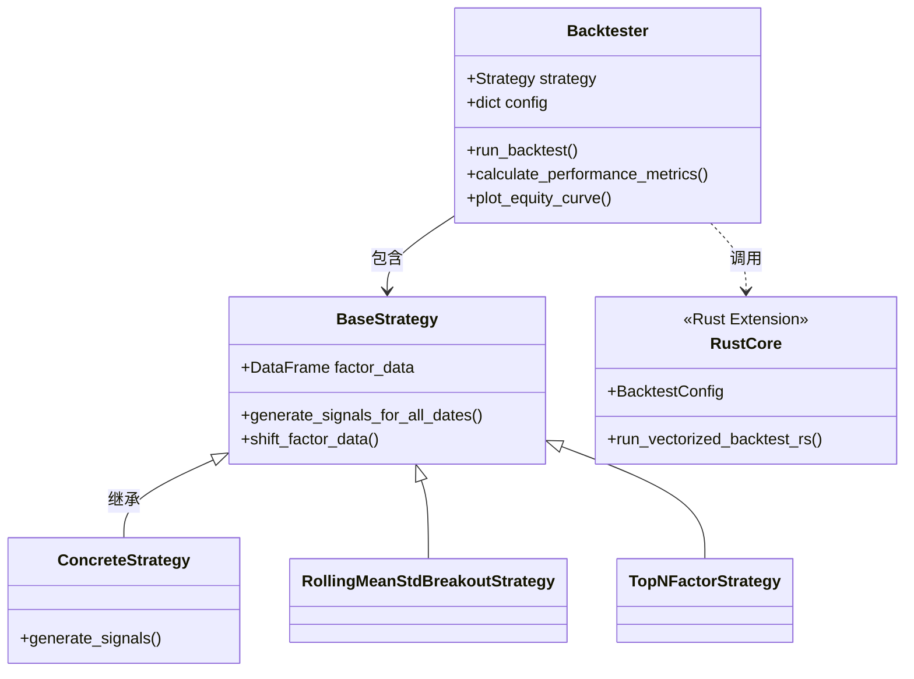
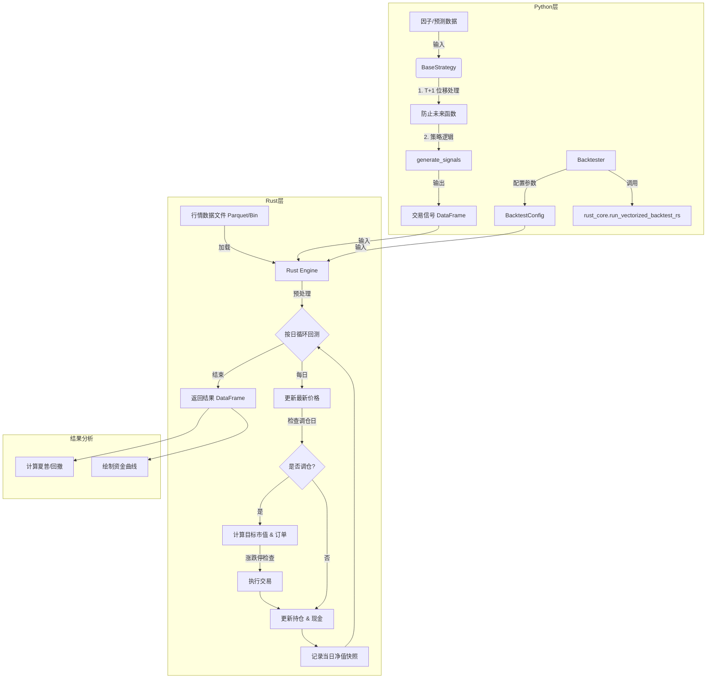

# LongGangTrader 回测框架详解

LongGangTrader 是一个高性能的量化回测系统，采用 **Python + Rust** 的混合架构。

### 为什么选择 Python + Rust？

*   **Python 的灵活性**: 利用 Python 丰富的数据科学生态（Pandas, Polars, PyTorch, Matplotlib）进行策略开发、数据分析和可视化，保持代码的简洁与易用性。
*   **Rust 的高性能**: 将计算密集型的逐日撮合、订单处理和资金维护逻辑下沉至 Rust 层实现。Rust 提供了内存安全、零成本抽象和极高的执行效率，显著缩短回测耗时，特别是在处理长周期、全市场（几千只股票）的高频回测时优势明显。
*   **无缝交互**: 通过 PyO3 和 Polars，实现了 Python 与 Rust 之间的数据零拷贝传输，消除了跨语言调用的性能瓶颈。

### 环境准备与编译

在使用本框架之前，请确保您的环境中已安装 Rust 工具链和 `maturin` 构建工具。

1.  **安装 Rust**: 请访问 [rustup.rs](https://rustup.rs/) 安装 Rust。
2.  **安装 Maturin**: `pip install maturin`
3.  **编译 Rust 核心模块**:
    在项目根目录下运行以下命令，将 Rust 代码编译为 Python 扩展模块：
    ```bash
    maturin develop --release
    ```
    *注意：必须使用 `--release` 标志以启用 Rust 的编译器优化，否则回测速度可能会受到影响。*

## 1. 系统架构

系统主要由三个核心部分组成：
1.  **策略模块 (`strategy`)**: 负责因子处理和信号生成。
2.  **回测控制模块 (`backtester`)**: 负责流程协调、指标计算和可视化。
3.  **底层引擎 (`rust_core`)**: 负责高性能的订单撮合和账户维护。



## 2. 回测工作流

数据从因子生成开始，经过策略层的处理转化为目标持仓权重，最终输入 Rust 引擎进行撮合，输出资金曲线。



## 3. 模块详解

### 3.1 策略模块 (Strategy)

位于 `longgang_trader.backtesting.strategy`。

*   **核心类**: `BaseStrategy`
*   **防未来函数机制**: 在初始化时，基类会自动调用 `__shift_factor_data__`，将因子数据的日期向后推移一个交易日（T -> T+1）。这意味着 T 日收盘后计算出的因子，只能在 T+1 日开盘时用于交易。
*   **信号生成**: `generate_signals_for_all_dates` 方法通常返回一个包含 `date`, `symbol`, `weight` 的 Polars DataFrame。

**内置策略示例**:
*   **RollingMeanStdBreakoutStrategy**: 滚动均值+标准差突破策略。
    *   逻辑: 当短期均值 > 长期均值 + k * 长期标准差时买入。
    *   加权: 根据预测值占比进行归一化。

### 3.2 回测控制模块 (Backtester)

位于 `longgang_trader.backtesting.backtester`。

*   **功能**: 连接用户策略与底层引擎。
*   **配置**: 支持设置初始资金、交易成本（印花税+佣金）、调仓周期、涨跌停限制等。
*   **分析**: `calculate_performance_metrics` 计算年化收益（单利/复利）、最大回撤、夏普比率等。
*   **可视化**: `plot_equity_curve` 使用 Matplotlib 绘制专业的净值曲线图。

### 3.3 底层回测引擎 (Rust Core)

位于 `rust_core` 目录，编译为 Python 扩展模块。

*   **高性能设计**:
    *   **零拷贝**: 使用 PyO3 和 Polars 实现 Python 与 Rust 间的数据高效传输。
    *   **数据结构**: 内部使用 `HashMap<Date, HashMap<Symbol, MarketData>>` 存储行情，实现 O(1) 复杂度的价格查询。
*   **撮合逻辑**:
    1.  **Mark-to-Market**: 每日根据最新收盘价计算持仓市值。
    2.  **订单生成**: 
        $$ \text{目标持仓市值} = \text{总权益} \times \text{目标权重} $$
        $$ \text{交易股数} = \frac{\text{目标持仓市值}}{\text{当前价格}} - \text{当前持仓股数} $$
    3.  **风控检查**:
        *   **涨停**: 禁止买入（价格 >= 昨日收盘 * (1+limit)）。
        *   **跌停**: 禁止卖出（价格 <= 昨日收盘 * (1-limit)）。
    4.  **成本扣除**: 交易完成后从现金中扣除 `transaction_cost_pct` 比例的费用。

## 4. 快速开始

以下示例参考自 `tests/all_in_one.ipynb`，展示了如何配置并运行一个基于滚动均值突破策略的回测。

```python
import polars as pl
from longgang_trader.backtesting import Backtester
from longgang_trader.backtesting.strategy import RollingMeanStdBreakoutStrategy

# 1. 准备配置参数
config_strategy = {
    "short_window": 20,       # 短期平滑窗口
    "long_window": 120,       # 长期趋势窗口
    "std_multiplier": 1.5,    # 标准差倍数
    "min_score": 0.0,         # 最小分数门槛
    "date_col": "date",
    "symbol_col": "code",
    "weight_col": "factor_score",
}

config_backtester = {
    "close_col": "close",
    "volume_col": "volume",
    "preclose_col": "preclose",
    "limit_pct": 0.1,             # 涨跌停限制 10%
    "initial_capital": 1_000_000, # 初始资金
    "transaction_cost": 0.001,    # 交易成本千分之一
    "rebalance_days": 1,          # 每日调仓
    "start_date": "2023-09-23"    # 回测开始日期
}

# 2. 准备因子数据
# 假设 factor_data 是一个 Polars DataFrame，包含 date, code, factor_score 列
# factor_data = pl.read_parquet("path/to/your/factors.parquet")

# 3. 初始化策略与回测器
# market_data_path 指向包含历史行情的 parquet 文件
market_data_path = "../data/baostock_data_filled.parquet"
strategy = RollingMeanStdBreakoutStrategy(factor_data=factor_data, config=config_strategy)
backtester = Backtester(strategy=strategy, data_path=market_data_path, config=config_backtester)

# 4. 运行回测
backtester.run_backtest()

# 5. 查看结果
backtester.plot_equity_curve()
```
